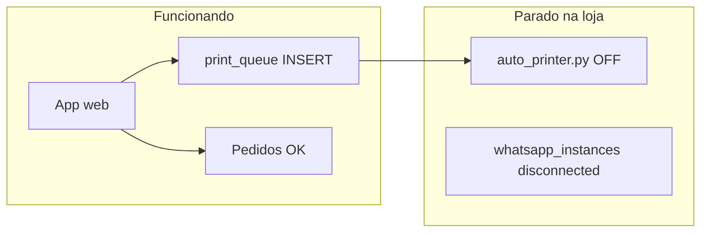

# Rei do Açaí — resultado diagnóstico impressão + WhatsApp

**Data:** 2026-09-11 (BRT)  
**Company ID:** `b2f97590-ff21-4951-95dc-e3e2b19d4ccb`  
**Subdomínio:** `reidoacai.comandatech.com.br`  
**API:** Lovable Cloud (`iwmrtxdzlkasuzutxvhh.supabase.co`)  
**Script:** `node scripts/rei-do-acai-audit-readonly.mjs`

---

## Resumo executivo

| Sistema | Status | Causa provável |
|---------|--------|----------------|
| **Impressão** | Quebrada | **14 jobs na fila `printed=false`** — o app enfileira corretamente, mas **`auto_printer.py` não está consumindo** (script parado no PC da loja) |
| **WhatsApp** | Quebrado | **Zero mensagens nas últimas 48h** apesar de pedidos com telefone e confirmações — instância Evolution **desconectada** ou nunca reconectada após reboot |

**Conclusão:** não é bug de deploy nem setting desligada. São duas falhas **operacionais independentes** (PC da loja + WhatsApp).

**Atualização 2026-09-11 (noite):** operador reportou erro **`DLL load failed while importing win32ui`**. Fix v**1.7.7** deployado: DLL inline + **fallback RAW** quando win32ui falha (comanda imprime mesmo sem GDI). Launcher **v1.7-cmd**. Painel atualizado — rebaixar pacote e rodar `instalar_impressao.cmd` como Admin.

**Atualização 2026-09-12 — layout V39:** referência correta = recibo GDI (`TESTE V39.pdf`), não comanda de produção. Diagnóstico remoto: `print_layout=v2`, `58mm`, fila `pending=0` (jobs consumidos). Causas do layout errado: (1) fallback RAW sem GDI; (2) cardápio só enfileirava comanda (sem recibo); (3) `buildReceiptHTML` simplificado. Fix v**1.7.8**: `buildReceiptHtmlV2Rich` + parser GDI `.store-name` + recibo automático no cardápio (Rei do Açaí + Amore Mio).

---

## 1. Impressão

### Configuração (OK)

| Setting | Valor |
|---------|-------|
| `auto_print_production_ticket` | `true` |
| `print_layout` | `v2` |
| `printer_paper_size` | `58mm` |
| Modo GDI | Sim (`GDI_COMPANY_IDS` em `auto_printer.py`) |

### Fila `print_queue`

| Métrica | Valor |
|---------|-------|
| Jobs pendentes (`printed=false`) | **14** |
| Estações configuradas | **0** (usa impressora padrão Windows) |
| `station_id` nos jobs | `null` (esperado para cardápio) |

### Últimos jobs pendentes (amostra)

| Hora (UTC) | Label |
|------------|-------|
| 23:14 | Produção Pedido #63 |
| 22:41 | Produção B-147 |
| 22:35 | Produção Pedido #51 |
| 22:11 | Produção Pedido #40 |
| 21:58 | Produção Pedido #37 |

**Interpretação:** cada pedido gera job em ~2 segundos. Nenhum foi marcado `printed=true` hoje → **`iniciar_impressao.cmd` / `auto_printer.py` não está rodando** (causa #1 quando “parou do nada” após reboot do PC).

---

## 2. WhatsApp

### Módulo

- `whatsapp`: **habilitado** (export login-bundle / histórico da loja)
- `whatsapp_instances`: não visível via anon (RLS) — **verificar no painel da loja**
- `whatsapp_messages` (48h): **0 registros** (`sent` ou `failed`)

### Correlação pedidos × WhatsApp (últimos 8 pedidos)

Todos os pedidos com telefone real tiveram **`whatsapp: []`** — nenhuma mensagem gravada:

| Pedido | Cliente | Telefone | Confirmado | Print job | WhatsApp |
|--------|---------|----------|------------|-----------|----------|
| #63 | Agatha | sim | sim | sim, pendente | **nenhum** |
| #51 | Stefani | sim | sim | sim, pendente | **nenhum** |
| #40 | Gian | sim | sim | sim, pendente | **nenhum** |
| #37 | Raissa | sim | sim | sim, pendente | **nenhum** |
| #14 | Adrian | sim | sim | sim, pendente | **nenhum** |

**Interpretação:** `notify-store-order` e `updateOrderStatus` não estão entregando mensagens — padrão típico de **instância WhatsApp desconectada** (`status != connected`).

---

## 3. Causa raiz



1. **Impressão P0:** `auto_printer.py` parado → 14 comandas acumuladas.
2. **WhatsApp P0:** Evolution desconectado → zero envios em 48h.

---

## 4. Checklist — PC da loja (Tainara)

### Erro DLL (reportado) — corrigir primeiro

Se `iniciar_impressao.cmd` mostra **`DLL load failed while importing win32print/win32ui`**:

1. **Baixar pacote novo** em Configurações → Impressão (4 arquivos):
   - `instalar_impressao.cmd`
   - `iniciar_impressao.cmd` (v**1.7-cmd** — mostra erro do verificador na tela)
   - `verificar_pywin32.py`
   - `auto_printer.py` (v**1.7.7** — DLL inline + fallback RAW se win32ui falhar)
2. Salvar tudo em `C:\ComandaTech`
3. Botão direito em **`instalar_impressao.cmd`** → **Executar como administrador**
4. Validar manualmente no Prompt:
   ```cmd
   cd C:\ComandaTech
   python verificar_pywin32.py
   ```
   Esperado: `pywin32/win32print: OK` e nome da impressora padrão
5. Se verificar OK mas iniciar falha → **reiniciar Windows** e repetir passo 3
6. Duplo-clique em **`iniciar_impressao.cmd`** — deve abrir **"ATIVO E MONITORANDO"**

> Python 3.14 não é suportado. O instalador força Python 3.12.2.

### Impressão (após DLL OK)

- [ ] Conferir **`company_id.txt`** = `b2f97590-ff21-4951-95dc-e3e2b19d4ccb`
- [ ] Impressora **58mm** online, com papel, definida como padrão no Windows
- [ ] Janela **`iniciar_impressao.cmd`** permanece aberta durante o expediente
- [ ] Se PC reiniciou: script **não sobe sozinho** — reabrir ou atalho na Inicialização

Ao subir o script, as **14 comandas pendentes** devem imprimir em sequência (~5s cada).

### WhatsApp

- [ ] Painel → **WhatsApp** → status **Conectado** (QR verde)
- [ ] Se desconectado: escanear QR **ou** botão **"Resetar Conexão"** (exclusivo Rei do Açaí)
- [ ] Teste: avançar pedido #63 para **Pronto** → toast *"Notificação WhatsApp enviada!"*

---

## 5. Teste controlado (após correção)

| # | Ação | Esperado |
|---|------|----------|
| 1 | Script impressão ativo + WhatsApp conectado | — |
| 2 | **Cardápio online** — pedido teste R$ 5 com telefone real | Comanda imprime em ~5s; cliente recebe *"aguardando confirmação"* |
| 3 | Clicar **Confirmar** no card | Cliente recebe resumo do pedido |
| 4 | **Preparando → Pronto → Entregue** | Uma mensagem por transição |
| 5 | **Pedido Express** — enviar pedido | Comanda na fila; WhatsApp só ao mudar status no painel (comportamento normal — Express não auto-notifica como Amore Mio) |

---

## 6. Fix de código aplicado (2026-09-11)

| Arquivo | Mudança |
|---------|---------|
| `scripts/auto_printer.py` v**1.7.7** | DLL inline + fallback RAW quando win32ui falha |
| `scripts/iniciar_impressao.cmd` v**1.7-cmd** | Exibe saída do verificador; mensagem clara sobre DLL + Admin |
| `deploy/bon-appetit-auto_printer.py`, `deploy/i9-auto_printer.py` | Mesmo patch DLL |

Loja precisa **rebaixar** os arquivos pelo painel para receber a versão nova.

---

## 7. Próximos passos

| Prioridade | Ação | Responsável |
|------------|------|-------------|
| **P0** | `instalar_impressao.cmd` como Admin + `verificar_pywin32.py` OK | Operador |
| **P0** | Rebaixar pacote v1.7.6 do painel → `iniciar_impressao.cmd` | Operador |
| **P0** | WhatsApp conectado no painel (já tentou reconectar) | Operador |
| **P1** | Inicialização automática do script no Windows | Operador / suporte |
| **P2** | Confirmar fila `pending: 0` após script ativo | Suporte |

**Reauditoria 2026-09-11 ~20:30 BRT:** fila ainda **14 pendentes** — script ainda não consumindo na loja.

---

## 8. Reexecutar auditoria

```bash
cd comandatech
node scripts/rei-do-acai-audit-readonly.mjs
```

Verificar: `pending: 0` na fila e mensagens `sent` em `whatsapp_messages` após teste.
